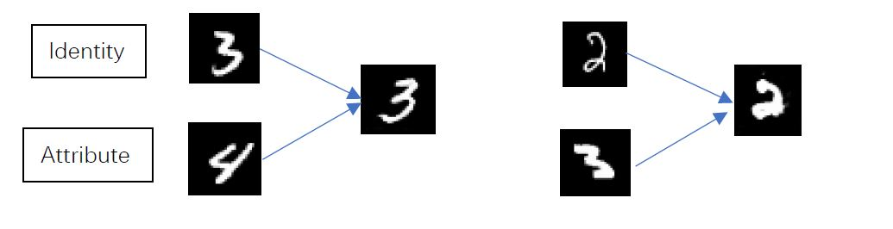

# Style-transfer-on-Hand-Written-Numbers

## Introduction
In this task, we want to generate a new digit based on digit A's identity (what number it is) and digit B's attribute (the stroke width, rotation, e.t.c).

## Network Structure
 \
For more details about the structure, please refer to this [paper](https://arxiv.org/abs/1803.11182). My network structure is similar to the model mentioned in this paper.

## How to Use
### Requirements
* Python 3.6
* Pytorch 1.0.0
* CUDA
* cudnn

### Train
    python main.py
Hyperparameters can be adjusted in the file "main.py". 

## Some results
 \
The numbers in red boxes are some good examples showing the proposed method works.

## Acknowledgements
Code derived and rehashed from:
* [GAN for MNIST](https://github.com/Burton2000/CS231n-2017/blob/master/assignment3/GANs-PyTorch.ipynb)

Reference
* [Towards Open-Set Identity Preserving Face Synthesis](https://arxiv.org/abs/1803.11182)
